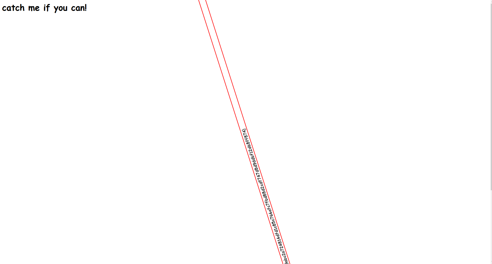

# Catch me if you can

Somebody [help](https://catch-me-if-you-can.web.actf.co/)!

Author: JoshDaBosh

## Solution

A link is provided redirecting to a spining text


Dont bother trying to catch this with a screenshot or anything press f12 and open the developper tools.
```html
<html>
    <head>
        <!-- ~~~ -->
    </head>
    <body>
        <h1>catch me if you can!</h1>
        <marquee scrollamount="50" id="flag">
            actf{y0u_caught_m3!_0101ff9abc2a724814dfd1c85c766afc7fbd88d2cdf747d8d9ddbf12d68ff874}
        </marquee>
    </body>
</html>
```

You can see the flag here

## Flag

actf{y0u_caught_m3!_0101ff9abc2a724814dfd1c85c766afc7fbd88d2cdf747d8d9ddbf12d68ff874}