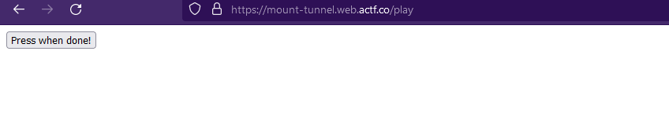

# Celeste Speedrunning Association

I love Celeste Speedrunning so much!!! It's so funny to watch!!!

[Here's my favorite site!](https://mount-tunnel.web.actf.co/)

Author: paper

## Solution


As writen on the website let's add /play to the url (https://mount-tunnel.web.actf.co/play)


On this new page we can only see a button unless checking out the developer tools.

```html
<form action="/submit" method="POST">
  <input type="text" style="display: none;" value="1682612700.121992" name="start" />
  <input type="submit" value="Press when done!" />
</form>
```
we can see that there is a hidden input field with a certain value this value change whenever the page is refreshed.
This look like a UNIX timestamp.

So just curl to the submit page with a UNIX timestamp value in the future.

```bash
curl -X POST https://mount-tunnel.web.actf.co/submit -d "start=9999999999"
you win the flag: actf{wait_until_farewell_speedrun}
```

## Flag
actf{wait_until_farewell_speedrun}