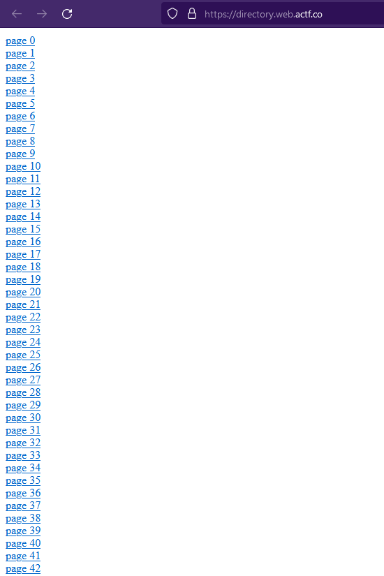

# Directory

[This](https://directory.web.actf.co/) is one of the directories of all time, and I would definitely rate it out of 10.

Author: JoshDaBosh

## Solution



We can see that there is a total of 5000 different page in which all have the same content except one.

We will use the following python script so we dont have to check every page by hand.

```python
import requests

i = 0
while 1:
    response = requests.get("https://directory.web.actf.co/{}.html".format(i))
    if (response.text != "your flag is in another file"):
        break
    i = i + 1
print(requests.get("https://directory.web.actf.co/{}.html".format(i)).text)
```

```bash
python3 script.py 
actf{y0u_f0und_me_b51d0cde76739fa3}
```

## Flag

actf{y0u_f0und_me_b51d0cde76739fa3}
