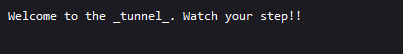

# Celeste Tunneling Association

[Welcome to the tunnels!!](https://pioneer.tailec718.ts.net/) Have fun!

[Here's the source](https://files.actf.co/5b5169bad21a7256564e8d49103f2b97bb2d2db7cdf3446fe6c9e11f9500922e/server.py)

Author: paper

## Solution

There is nothing worth noting on the website link as its only composed of a plain text.



If we however interest ourself to the source file

```python
# run via `uvicorn app:app --port 6000`
import os

SECRET_SITE = b"flag.local"
FLAG = os.environ['FLAG']

async def app(scope, receive, send):
    assert scope['type'] == 'http'

    headers = scope['headers']

    await send({
        'type': 'http.response.start',
        'status': 200,
        'headers': [
            [b'content-type', b'text/plain'],
        ],
    })

    # IDK malformed requests or something
    num_hosts = 0
    for name, value in headers:
        if name == b"host":
            num_hosts += 1

    if num_hosts == 1:
        for name, value in headers:
            if name == b"host" and value == SECRET_SITE:
                await send({
                    'type': 'http.response.body',
                    'body': FLAG.encode(),
                })
                return

    await send({
        'type': 'http.response.body',
        'body': b'Welcome to the _tunnel_. Watch your step!!',
    })
```

We can see that the server check if there is anything is the headers and add 1 if the host value is present.
So all we need to do is add the value "flag.local" as the host value (writen at the top of the file under the variable SECRET_SITE).

```bash
curl --header "host: flag.local" https://pioneer.tailec718.ts.net/
actf{reaching_the_core__chapter_8}
```

## Flag 
actf{reaching_the_core__chapter_8}