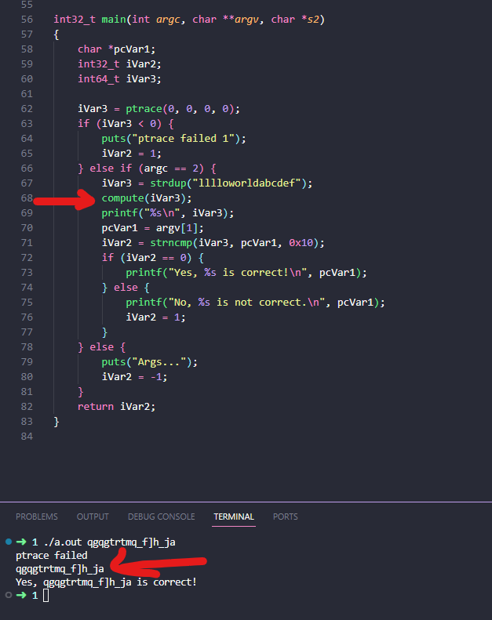

# Anti DBG

## Given data

## Solution

Open cutter and copy the decompiled main and compute function

add a ```printf("%s\n", iVar3);``` after the compute function call.



## Flag

qgqgtrtmq_f]h_ja