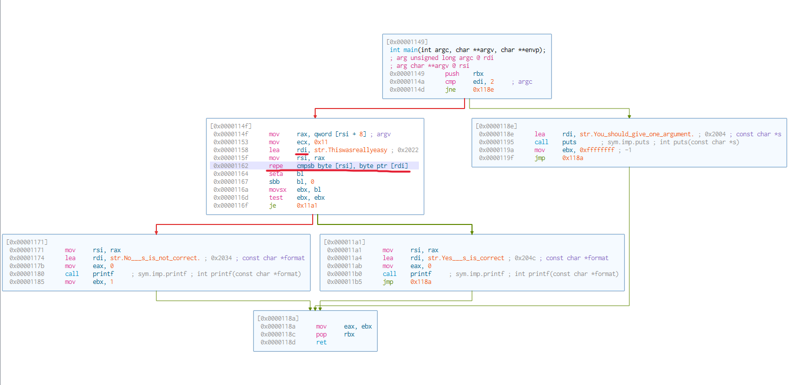
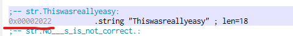

# Elf

## Solution

chmod 755 ELF_01
open Cutter


if you watch the Graphe of the main function you can see that the program is doing a comparison of a user given argument and the value at 0x2022



```
./ELF_01 Thiswasreallyeasy
```
## Flag

Thiswasreallyeasy