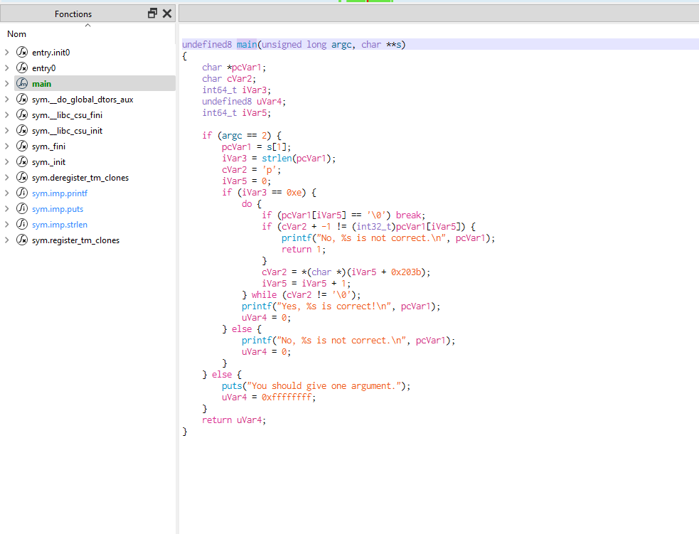
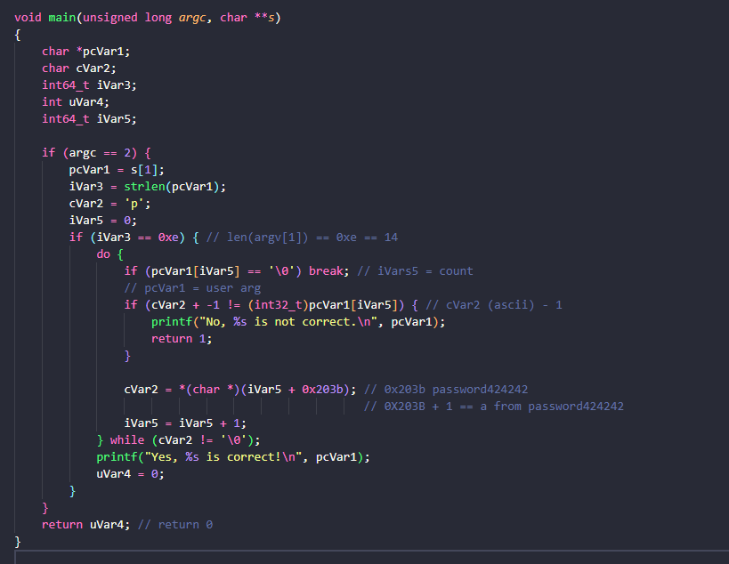

# Elf_02

## Solution

chmod 755 ELF_02_bis
open Cutter
open the decompiler tab
make sure the use decompiler is Ghidra (bottom right of Cutter)

you should then have the following view


We can then simplify, remove and isolate what we are interested in


the password is password424242 with -1 on each ascii character

``` password424242
./ELF_02_bis o`rrvnqc313131
```
## Flag

o`rrvnqc313131