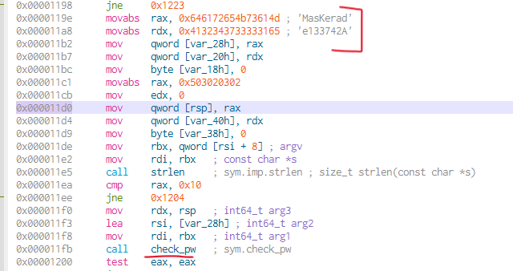
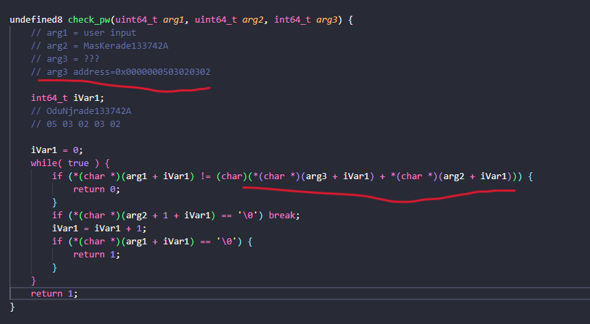
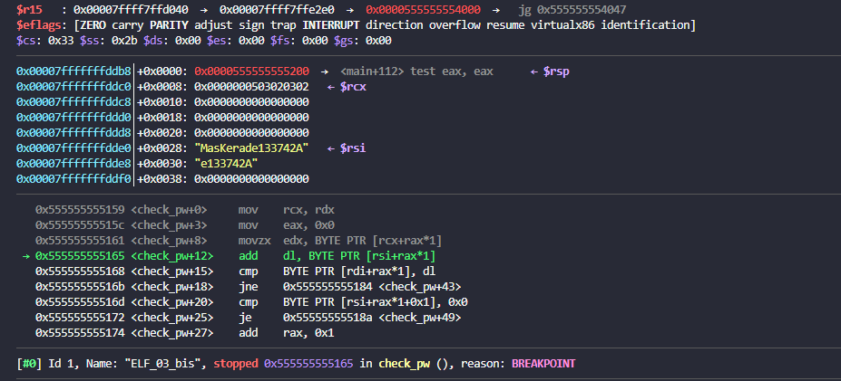

# Elf_03

## Solution

chmod 755 ELF_03_bis
open Cutter

There are a interesting element that we need to take note of (in red)


open the decompiler tab and paste the main and check_pw function in your code editor

if we analyze the check_pw function we can see that it check each character from the user input and (arg3[iVar1] + arg2[iVar1]).



arg3 is however empty as its indicated by <- $rcx on the screen


so we take instead its address's hex value and add it to arg2[iVar1] value

As it is a hex value we go by pair meaning that the first value to add to arg2[iVar1] is 02.

arg2[0] = M + 02 = O
and we do so for each arg2 character

thus giving you the following password OduNjrade133742A

```
./ELF_03_bis OduNjrade133742A
```
## Flag

OduNjrade133742A