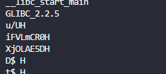
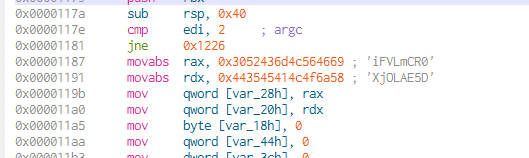

# Elf_fast

The ELF FAST type challenge are the same challenge as in the ELF type but the flag timeout after a few seconds after downloading the file thus forcing the use of a script.

## Solution

The linux 'strings' bin write out every strings in a bin which the len is higher than a certain value.




> Detail in ELF3

We can see that the same so we will use the strings bin with pythons, concat both strings and use the decoding key and get the flag.

```python
#!/usr/bin/env python3
from elftools.elf.elffile import ELFFile
import requests

import struct
import sys

import subprocess

FILE = 'ELF_03'

# Please checkout the ELF3 writeup to understand where the following
# value come from
decodeKey = [2,3,2,3,5]

def get_key():
    result = str(subprocess.run(['strings', './ELF_03'], stdout=subprocess.PIPE).stdout)
    s = ("u/UH")
    start = result.find(s) + len(s) + 2
    key1 = str(result[start:start + 8])
    key2 = str(result[start + 11:start + 19])
    return key1 + key2

def revCypher(key):
    newKey = ''

    for i in range(0, len(key)):
        if i < len(decodeKey):
            newKey += chr(ord(key[i]) + decodeKey[i])
        else:
            newKey += key[i]
    return newKey

if __name__ == "__main__":
    response = requests.get("http://reverse.blackfoot.io:8080/ELF_03")
    open(FILE, "wb").write(response.content)
    key = get_key()
    key = revCypher(key)
    a = "http://reverse.blackfoot.io:8080/validate/ELF_03/" + key
    response = requests.get(a)
    print(response.content)
```

## Flag

BFS[OmgSuchF4stn3ss]