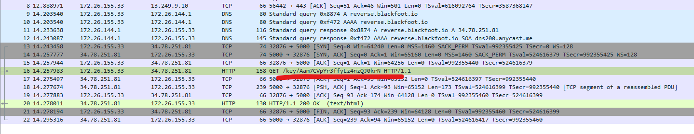
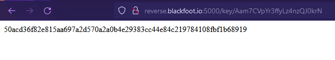
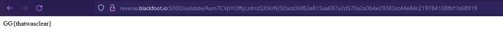

# Https

## Solution

Network mean wireshark.

With this we can see the first part of the final key to the flag
(Aam7CVpYr3ffyLz4nzQJ0krN)

If we check out the link follow the GET call we get another part of the final key

So if we take the base URL/validate/ and add the 2 key that we got we get the flag
(50acd36f82e815aa697a2d570a2a0b4e29383cc44e84c219784108fbf1b68919)

(http://reverse.blackfoot.io:5000/validate/Aam7CVpYr3ffyLz4nzQJ0krN/50acd36f82e815aa697a2d570a2a0b4e29383cc44e84c219784108fbf1b68919)

## Flag

GG{thatwasclear}