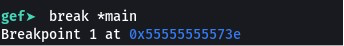
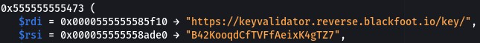
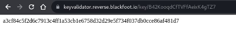
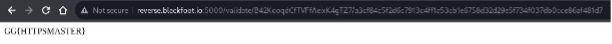

# Https

## Solution

The first step is to see the main binary function with a breakpoint.


We have the strings in the stack.



We add the URL with the string that have the RSI give us this value.


We associate the key 1 & 2 in this URL to obtain the flag


```
```
## Flag

GG{HTTPSMASTER}