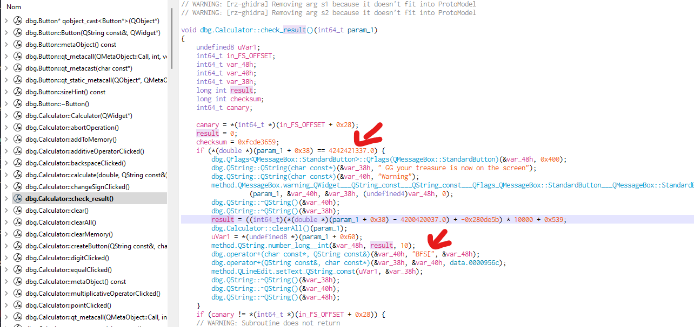

# QT

In the QT type challenge we are faced with bin using the QT library thus making it harder to find data due to the sheer amount of data unless you know what you are looking for.

## Given data

    Calculate !
    You may have to install libqt5printsupport5
    sudo apt install libqt5printsupport5

QtCalculator (bin)

## Solution

With strings I tried to grep again with the following keyword 'BFS' and 'flag' which none gave me intersting hint.

open cutter
I notice in the the first few line the check_result() function which pick my interest.



By annalysing the function we can notice the start of the flag and a condition which need us to type in "4242421337" and press the calculate button (as this is the check_result() function)

```
./QtCalculator
```


## Flag

BFS[13371337]