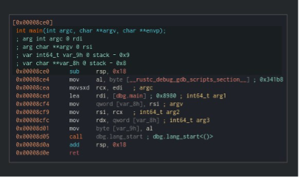
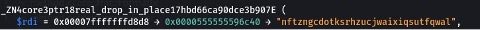
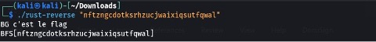

# Rust

## Solution

With Cutter we analyse the main function of this challenge.


We constate that the adress of the function "dbg.main" is stockin RDI.
We can take this adress on the function "dbg.main"

On the function dbg.main we constat that the string appear in the stack.


```
./rust-reverse "nftzngcdotksrhzucjwaixiqsutfqwal"
```
## Flag

BFS[nftzngcdotksrhzucjwaixiqsutfqwal]