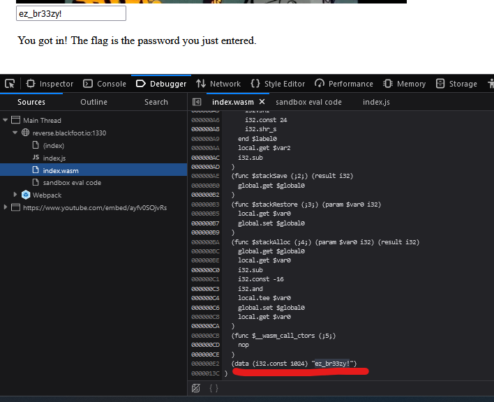

# WASM

WASM (WebAssembly) is assembly but in web meaning that we wont get the file and we will work directly with your web browser.

## Given data

    Get your flag at http://reverse.blackfoot.io:1330 !

## Solution

Open the web developper panel

## Flag

ez_br33zy!