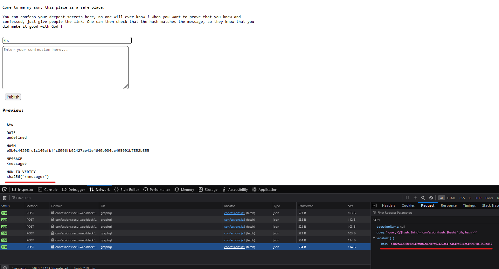
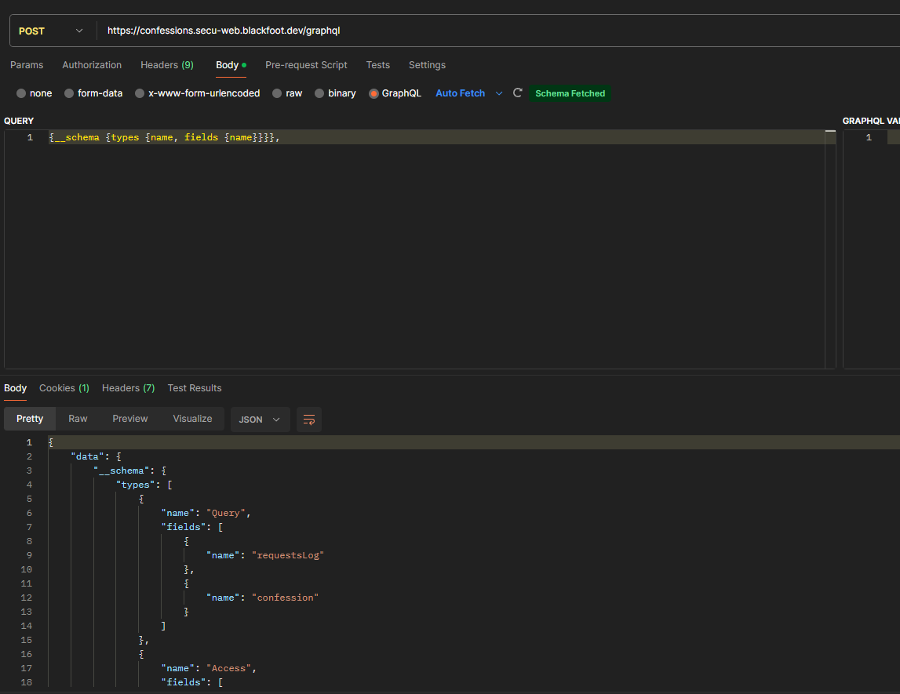
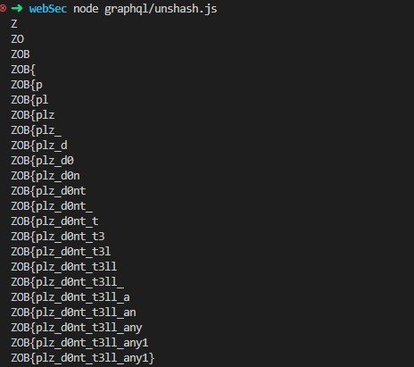

### Graphql

if we look around with the network tab open we can see that whenever we type something a post req is sent with either our message or a hash using a sha256 algorithm



we also know that it use GraphQL
and on postman there is a GraphQL field so we may as well poke around and see if we can get anything out of it
https://medium.com/@mrthankyou/how-to-get-a-graphql-schema-28915025de0e

and its seem to be a hit with 
> {__schema {types {name, fields {name}}}}



we can then try and access to the requestlog fields and see what we can get from there 
> {requestsLog {timestamp, args, name}}

Once again we can get hash and we know that each hash is one single letter as we could see while typing msg on the web ui so now we need to find a way to reverse the hash

As we remember they use a sha256 algorithm meaning that the following hash add a offset when the previous character is too short to create itself

so we need to uncover the flag sequence's one by one
> [!IMPORTANT]
> ZOB{plz_d0nt_t3ll_any1}



```js
const crypto = require("crypto");

const {
  data: { requestsLog: requests },
} = require("./confession.json");

const c = `0123456789abcdefghijklmnopqrstuvwxyzABCDEFGHIJKLMNOPQRSTUVWXYZ!"()<=>?_{|}~`.split("");

const hashes = requests
  .filter(({ name }) => name == "confession")
  .map(({ args }) => JSON.parse(args).hash);

const decryptChar = (prefix, hash) =>
  c.find((c) => crypto
        .createHash("sha256")
        .update(prefix + c)
        .digest("hex") == hash
  );

const decrypt = (hashes) =>
  hashes.reduce((prefix, hash, _, arr) => {
    const c = decryptChar(prefix, hash);

    if (!c) throw Error("Hash error check prefix or hash");
    console.log(`${(prefix + c).padEnd(arr.length, "")}`);

    return prefix + c;
  }, "");

console.log(decrypt(hashes));
```
