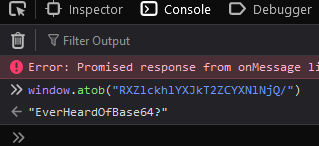

### JS

## b64js
We are welcomed with an alert telling us to enter the flag, by checking out the script section we got the following section.

```js
var pass = "RXZlckhlYXJkT2ZCYXNlNjQ/";
var input = window.prompt("Enter the flag here : ");
var b64input = window.btoa(unescape(encodeURIComponent(input)))

if (pass === b64input)
    alert("Congrats ! You can validate this challenge with the flag BFS{" + input + "}");
else
    alert("Call your mom and tell her you will be late for dinner ;)");  
```

The password is then the reverse of the btoa function atoa.



>[!IMPORTANT]
>BFS{EverHeardOfBase64}

## JS200
Once again we will check the JS script

```js
$('#but').click(function(e) {
    e.preventDefault();
});
function validate() {
	var flag = "K@UC,bswslubr.wohp.dibokdmdb";
	var input = document.getElementById("flag").value
	var i = 0
	var out = ""

    do {
		out += String.fromCharCode(input.charCodeAt(i) ^ 1);
		out += String.fromCharCode(input.charCodeAt(i + 1) ^ 3);
		out += String.fromCharCode(input.charCodeAt(i + 2) ^ 3);
		out += String.fromCharCode(input.charCodeAt(i + 3) ^ 7);
		i += 4;
	} while (i < 28);
    console.log(out); // Here <--

	if (out === flag) {
		alert("Congratz! Validate this challenge with the flag BFS{" + input + "}")
	} else {
		alert("Try again !")
	}
}

```

As we can see the flag is written out so we can just add a console log to print out the flag

>[!IMPORTANT]
>BFS{JCVD-approves-this-challenge}