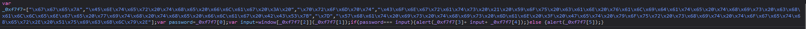
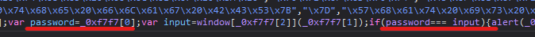
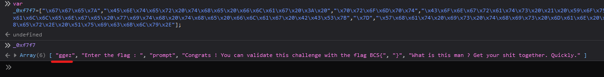

### Obfuscation

## OBF100

When we open the link we are greeted with an alert form meaning... JavaScript!

If we read the script we can see that the flag is in _0xf7f7[0]

so let go ahead and ask our navigator to tell us what it is

>[!IMPORTANT]
BCS{ggez}

