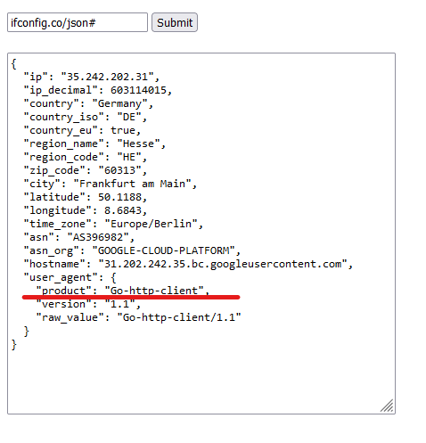

If we look for the /secret we get the msg that we do not come from 127.0.0.1 but from another IP address

When you try to access secret by inputing 127.0.0.1/secret it donsnt work due to the server appending :80 by itself to the end of your input so you can add # to comment it out
Doing so will give us img 1 asking us to find a way to send our GOSESSION cookie with the request

We can go and try to get more info on what is the server made of and try to find our attack angle from there

We can see on img 2 that it use a Go-HTTP-client version 1.1 and if we look around a bit there is vulnerability on this specific version (https://github.com/golang/go/issues/30794)

this allow us to input our payload by manipulating the header content from the params section

so if we add the needed payload we then get the following link:

> https://ssrf1.secu-web.blackfoot.dev/host?host=127.0.0.1/secret? HTTP/1.1%0D%0AHost: 127.0.0.1%0D%0ACookie: GOSESSION=guest-go1.11.5%0D%0AContent-Length: 0%0D%0A%0D%0A

This give us the following result

>{"content":"eyJvayI6dHJ1ZSwibWVzc2FnZSI6Ik9rIGhlcmUgaXMgeW91ciBmbGFnIC4uLiIsImZsYWciOiJCRlN7R29MYW5nX1Z1bG5fRlRXX0JyMDAwfSJ9Cg==","ok":true,"message":"Ok"}

> [!IMPORTANT]
> flag":"BFS{GoLang_Vuln_FTW_Br000}